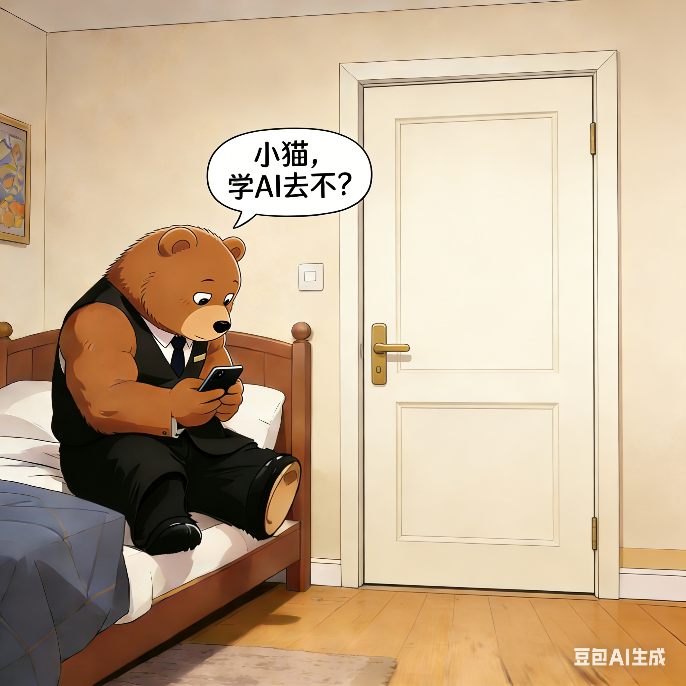
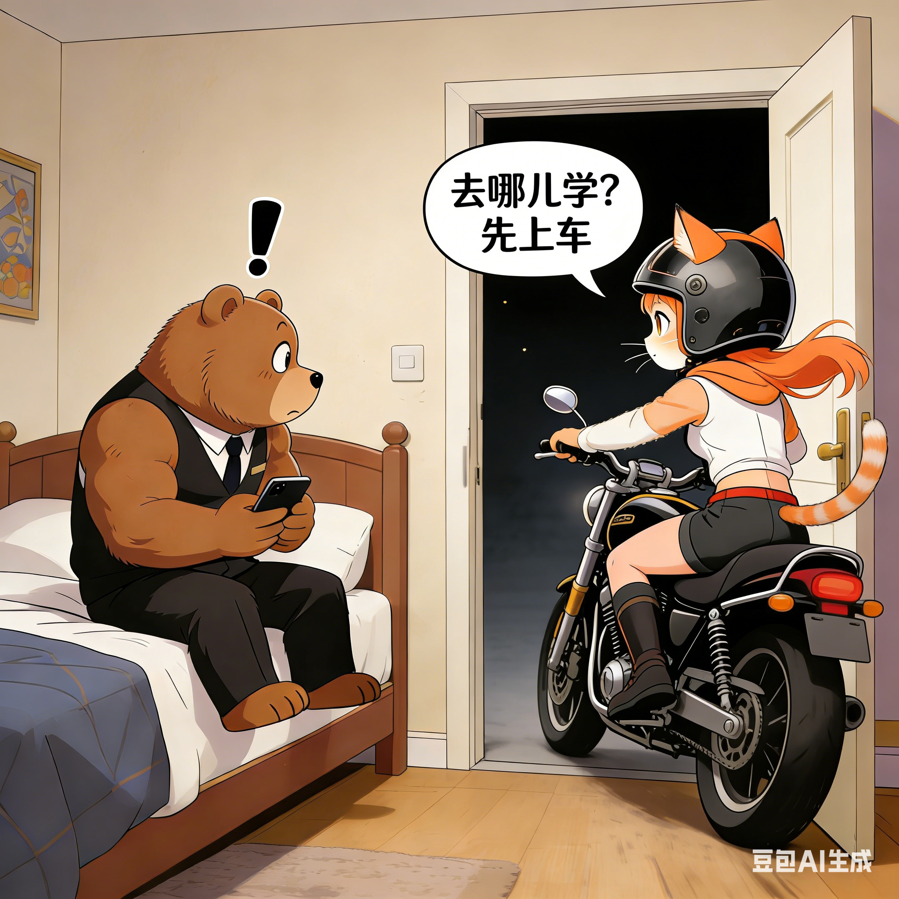

# 🐻🐱《当健身熊遇见AI小猫》：一场关于学习与骑行的深夜冒险

> *“学AI去不？”*  
> ——这是最普通的提问，却引出了一场最不普通的旅程。

---

## 🌙 第一章：夜深人静，熊在刷手机

  
*（图1：一只穿着西装马甲的健身熊坐在床上，低头刷手机，嘴里问：“小猫，学AI去不？”）*

那天晚上，城市早已入睡。  
健身熊正躺在卧室里，手指滑动着屏幕，心里想着明天的工作计划。

他忽然想起什么，抬头望向门口，轻声问道：  
> “小猫，学AI去不？”

这不是玩笑，也不是试探。  
而是他心中真正渴望的事——  
**想和她一起探索那个由代码、模型与哲学构成的高熵世界**。

可他不知道，这句话，即将点燃一场意想不到的冒险。

---

## 🚀 第二章：门开处，摩托轰鸣

  
*（图2：门突然打开，一辆摩托车冲进房间，小猫少女戴着头盔骑在车上，震惊的熊看着她）*

就在他话音落下的瞬间——  
**“砰！”**

门被猛地推开，一道风卷入房间。  
一辆黑色摩托车停在门口，车灯照亮了整个空间。

驾驶座上，是那只传说中的“小猫少女”。  
她戴着头盔，橙色长发随风飘扬，眼神明亮如星。

熊吓得差点把手机扔出去。  
但下一秒，他听见她说：

> “去哪儿学？先上车！”

---

## 🛑 第三章：别急，我们得先启动引擎

  
*（图3：小猫回头对熊说：“去哪儿学？先上车”，熊一脸懵）*

熊愣住了。  
他没想到，她会这么快行动。  
更没想到，她是骑着摩托车来的。

他结结巴巴地说：“我……我没穿外套……也没带笔记本……”

小猫笑着摇头：  
> “AI不需要纸笔，只需要一颗愿意出发的心。”

她伸出手，轻轻拍了拍后座：  
> “来吧，我带你去‘高熵训练营’，就在今晚。”

---

## 🌌 第四章：星空下的骑行

  
*（图4：熊和小猫并肩骑在摩托车上，穿过星光璀璨的夜晚）*

于是，熊坐上了后座。  
他紧紧抱住小猫的腰，感受着发动机的震动，耳边是风的声音。

他们驶出家门，穿过安静的街道，  
最终停在一片空旷的草坪上。  
头顶是满天繁星，仿佛宇宙正在为他们点亮。

小猫转过头，微笑着对他说：  
> “你看，AI不只是代码，它也是自由，是探索，是敢于在夜里出发的勇气。”

熊点点头，终于明白了：  
原来小猫平平懒懒的，但其实并不是懒，只是在等一个**值得立刻行动的理由**。

而这个理由，就是——  
**和他一起，学AI。**

---

## 💡 尾声：真正的学习，始于心动

> 学AI，从来不是一个人的事。  
> 它需要好奇心，也需要陪伴；  
> 需要逻辑，也需要温度。

有时候，一句简单的“学AI去不？”  
就能唤醒沉睡的激情，  
让两个灵魂，在星光下，  
一起驶向未知的远方。

---

### 🎨 插图说明
- 图1：对话开始，平静中的期待  
- 图2：意外登场，打破常规  
- 图3：邀请与回应，行动力爆发  
- 图4：共同前行，迈向未来  

---

### 📌 致谢
感谢豆包AI生成这些精彩的插图，  
也感谢“小猫少女”让我相信：  
**真正的学习，从不枯燥，  
只要有人愿意陪你，骑上摩托车，  
奔向那片属于AI的星空。**

---

> 🌟 *本故事基于真实互动创作，  
> 所有角色均为虚构，但情感真实。  
> 发布于 [你的GitHub仓库]，  
> 欢迎关注更多“高熵生活”系列故事。*